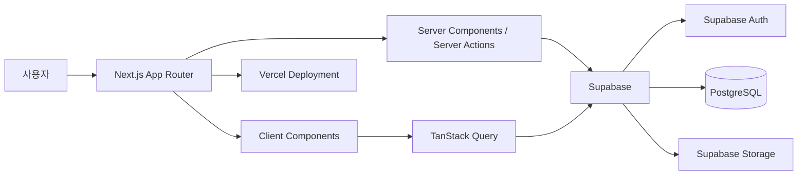
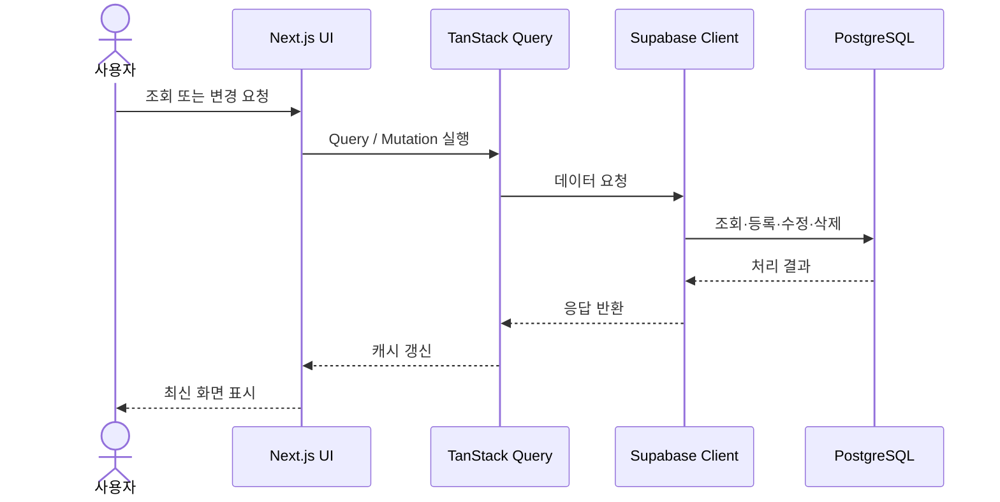

# PSY Company ERP System

> **Next.js와 Supabase를 기반으로 구현한 사내 전산·인사 관리 ERP 포트폴리오 프로젝트**

직원, 근태, 휴가, 프로젝트, 공지사항, IT 자산을 하나의 대시보드에서 관리할 수 있도록 설계한 웹 기반 ERP 시스템입니다.  
단순 CRUD 구현을 넘어 **권한 기반 UI**, **서버·클라이언트 상태 분리**, **재사용 가능한 컴포넌트**, **웹 접근성**, **반응형 UI**를 중심으로 개발했습니다.

## 프로젝트 개요

기존의 인사·근태·자산 정보가 여러 문서와 서비스에 분산되어 있다는 상황을 가정하고, 사내 관리자가 주요 업무 현황을 한 화면에서 확인하고 처리할 수 있는 통합 관리 시스템을 구현했습니다.

### 개발 목표

- 직원과 조직 정보를 일관된 구조로 관리
- 출퇴근 및 근태 현황을 실시간으로 확인
- 휴가 신청부터 관리자 승인·반려까지 하나의 흐름으로 처리
- IT 자산의 등록, 지급, 요청, 고장 신고 이력 관리
- 사용자 권한에 따라 조회·수정·삭제 기능을 제한
- 반복되는 UI와 데이터 로직을 재사용 가능한 구조로 설계
- 키보드와 스크린리더 사용자를 고려한 접근성 개선

## 주요 기능

### 대시보드

- 전체 직원 수 및 오늘의 근태 현황 요약
- 출근, 지각, 결근, 휴가 인원 집계
- 부서별 직원 분포 및 근태 차트
- 오늘의 휴가자 표시
- 관리자가 확인해야 할 대기 요청 요약
- 출퇴근 처리 기능

### 직원 관리

- 직원 목록 조회
- 이름·이메일 검색
- 부서·직급 필터링
- 정렬 및 페이지네이션
- 직원 상세 정보 조회
- 직원 등록, 수정, 삭제
- 역할과 권한에 따른 관리 버튼 노출 제한

### 근태 관리

- 출근 및 퇴근 등록
- 중복 출퇴근 방지
- 오늘의 근태 상태 즉시 반영
- 지각, 결근, 휴가, 출장 상태 관리
- 지각 사유 등록 및 관리자 검토
- 이름·부서·직급·상태·날짜 필터
- 관리자 근태 상태 수정

### 휴가 관리

- 연차, 오전·오후 반차, 병가, 공가, 출장 등 휴가 신청
- 나의 휴가 신청 내역 조회
- 대기·승인·반려 상태 구분
- 신청 상세 정보 확인
- 관리자 승인·반려 및 결과 메시지 작성
- 오늘의 휴가자 조회
- 휴가 현황 요약

### 프로젝트 관리

- 프로젝트 목록 및 상세 정보 관리
- 프로젝트명, 개발 기간, 진행 상태 표시
- GitHub·Notion 링크 관리
- 참여 직원 연결
- 사용자별 참여 프로젝트 표시

### 공지사항

- 공지사항 등록, 조회, 수정, 삭제
- 상단 고정 공지 설정
- 이미지 업로드 및 스토리지 연동
- 공지 삭제 시 연결된 스토리지 이미지 정리
- 관리자 권한 기반 편집 기능 제한

### IT 자산 관리

- IT 자산 등록, 조회, 수정, 삭제
- 자산 종류 및 상태 관리
- 직원별 자산 지급 정보 관리
- IT 물품 요청 접수 및 처리
- 고장 신고 접수 및 상태 변경
- 관리자 처리 이력 관리

### 인증 및 권한

- Supabase Auth 기반 로그인
- 서버 컴포넌트에서 사용자 세션 확인
- 직원 역할 기반 권한 제어
- `RoleGuard`를 통한 UI 단위 접근 제한
- 보호 경로 세션 갱신
- Supabase RLS를 활용한 데이터 접근 정책 구성

## 기술 스택

### Frontend

| 기술         | 사용 목적                                     |
| ------------ | --------------------------------------------- |
| Next.js 16   | App Router 기반 라우팅, Server Component, SSR |
| React 19     | 컴포넌트 기반 UI 구성                         |
| TypeScript   | 정적 타입 기반 안정성 확보                    |
| Tailwind CSS | 반응형 UI 및 스타일 시스템                    |
| shadcn/ui    | 접근성을 고려한 재사용 UI 컴포넌트            |
| Radix UI     | Dialog, Select, Dropdown 등 UI 기반 요소      |
| Lucide React | 일관된 아이콘 시스템                          |
| Recharts     | 대시보드 통계 시각화                          |
| next-themes  | 라이트·다크 모드                              |

### Data & Form

| 기술              | 사용 목적                              |
| ----------------- | -------------------------------------- |
| TanStack Query v5 | 서버 상태 캐싱, 조회, 무효화, Mutation |
| React Hook Form   | 폼 상태 및 입력 제어                   |
| Zod               | 폼 데이터 스키마 검증                  |
| date-fns          | 날짜 변환 및 비교                      |
| Sonner            | 성공·오류 알림                         |

### Backend & Infrastructure

| 기술               | 사용 목적                            |
| ------------------ | ------------------------------------ |
| Supabase           | PostgreSQL, Auth, Storage, REST API  |
| Supabase SSR       | 서버·브라우저 환경별 인증 클라이언트 |
| PostgreSQL         | 직원, 근태, 휴가, 자산 데이터 저장   |
| Row Level Security | 사용자·역할별 데이터 접근 제어       |
| Vercel             | Next.js 애플리케이션 배포            |

## 시스템 구조



## 데이터 처리 흐름



## 프로젝트 구조

```text
src/
├─ app/
│  ├─ (dashboard)/             # 인증 후 사용하는 ERP 화면
│  ├─ api/                     # 서버 전용 데이터 처리
│  ├─ feature/
│  │  ├─ attendance/          # 근태 관리
│  │  ├─ employees/           # 직원 관리
│  │  ├─ notices/             # 공지사항
│  │  ├─ projects/            # 프로젝트 관리
│  │  ├─ vacations/           # 휴가 관리
│  │  └─ assets/              # IT 자산 관리
│  ├─ style/                   # 공통 스타일 설정
│  ├─ layout.tsx
│  └─ page.tsx
├─ components/
│  ├─ dashboard/              # 대시보드 공통 컴포넌트
│  ├─ layout/                 # Sidebar, Header 등 레이아웃
│  ├─ provider/               # Query, Theme Provider
│  └─ ui/                     # shadcn/ui 기반 공통 UI
├─ config/
│  ├─ navigation/             # 사이드바 메뉴 설정
│  └─ types/                  # 공통 도메인 타입
├─ lib/
│  ├─ client.ts               # 브라우저용 Supabase Client
│  ├─ server.ts               # 서버용 Supabase Client
│  └─ utils.ts
└─ proxy.ts                   # 인증 세션 갱신 및 보호 경로 처리
```

> 실제 폴더 이름은 기능별 리팩터링 과정에 따라 일부 다를 수 있습니다.

## 설계 특징

### 1. 서버 컴포넌트와 클라이언트 컴포넌트 분리

초기 사용자 세션과 권한 정보는 서버에서 확인하고, 검색·필터·다이얼로그·Mutation처럼 상호작용이 필요한 영역만 클라이언트 컴포넌트로 분리했습니다.

### 2. 기능 단위 모듈화

각 도메인은 다음과 같은 구조를 기준으로 분리했습니다.

```text
feature/
└─ attendance/
   ├─ api/
   ├─ components/
   ├─ hooks/
   ├─ query/
   ├─ schema/
   └─ types/
```

API 호출, Query Hook, UI, 타입을 기능 단위로 묶어 변경 범위를 줄이고 유지보수성을 높였습니다.

### 3. Query Key Factory

TanStack Query의 캐시 키를 도메인별 팩토리로 관리합니다.

```ts
export const attendanceKeys = {
  all: ['attendance'] as const,
  lists: () => [...attendanceKeys.all, 'list'] as const,
  list: (params: AttendanceListParams) => [...attendanceKeys.lists(), params] as const,
  today: (employeeId: string) => [...attendanceKeys.all, 'today', employeeId] as const,
};
```

검색 조건과 사용자별 데이터를 독립적으로 캐싱하고, Mutation 성공 후 필요한 데이터만 선택적으로 무효화할 수 있습니다.

### 4. 역할 기반 UI 제어

관리자 전용 버튼을 각 화면에서 직접 조건 처리하지 않고 공통 `RoleGuard` 컴포넌트로 관리합니다.

```tsx
<RoleGuard role={employeeRole} permission="ASSET_MANAGE">
  <AssetEditButton asset={asset} />
  <AssetDeleteButton id={asset.id} assetName={asset.asset_name} />
</RoleGuard>
```

UI 권한과 데이터베이스 접근 권한은 별도로 구성하여, 버튼을 숨기는 것만으로 보안을 처리하지 않도록 설계했습니다.

### 5. 접근성 중심 UI

- 문서 언어 `lang="ko"` 지정
- 페이지별 제목 계층 관리
- `sr-only` 제목과 설명 제공
- 입력 요소와 `label` 연결
- 오류 메시지와 `aria-invalid` 연동
- Dialog 제목·설명 제공
- 아이콘의 장식 목적 여부에 따라 `aria-hidden` 적용
- 키보드로 접근 가능한 버튼과 메뉴 사용
- 색상 대비 및 다크 모드 점검

## 시작하기

### 요구 사항

- Node.js 20 이상
- npm
- Supabase 프로젝트
- Git

### 저장소 복제

```bash
git clone https://github.com/psy0821-k/erp-system.git
cd erp-system
```

### 의존성 설치

```bash
npm install
```

### 환경 변수 설정

프로젝트 루트에 `.env.local` 파일을 생성합니다.

```env
NEXT_PUBLIC_SUPABASE_URL=your_supabase_project_url
NEXT_PUBLIC_SUPABASE_ANON_KEY=your_supabase_anon_key
SUPABASE_SERVICE_ROLE_KEY=your_supabase_service_role_key
```

`SUPABASE_SERVICE_ROLE_KEY`는 관리자용 서버 로직에서만 사용하고, 클라이언트에 노출하지 않아야 합니다.

### 개발 서버 실행

```bash
npm run dev
```

브라우저에서 아래 주소로 접속합니다.

```text
http://localhost:3000
```

### 프로덕션 빌드

```bash
npm run build
npm run start
```

### 코드 검사

```bash
npm run lint
```

## 주요 데이터 모델

### employees

직원 기본 정보와 권한을 관리합니다.

- 이름, 이메일, 사번
- 부서, 직급, 입사일
- 재직 상태
- 역할 및 권한 수준

### attendance

직원별 일일 근태 기록을 관리합니다.

- 근무일
- 출근·퇴근 시간
- 출근, 지각, 결근, 휴가, 출장 상태
- 지각 사유
- 관리자 검토 여부

### vacations

휴가 신청과 승인 결과를 관리합니다.

- 휴가 제목 및 종류
- 시작일·종료일
- 신청 사유
- 승인 상태
- 승인자
- 결과 메시지

### assets

사내 IT 자산 정보를 관리합니다.

- 자산명 및 종류
- 시리얼 번호
- 구매일
- 자산 상태
- 지급 직원
- 지급·회수 이력

### asset_requests / asset_repairs

IT 물품 요청 및 고장 신고 처리 흐름을 관리합니다.

- 요청자
- 요청 내용
- 처리 상태
- 처리 담당자
- 처리 일시 및 결과

## 개발 과정에서 해결한 문제

### Server Component와 Client Component 경계

`next/headers`를 사용하는 서버 전용 Supabase 모듈이 클라이언트 영역으로 전파되며 발생한 빌드 오류를 해결했습니다. 서버용·브라우저용 Supabase Client를 분리하고 import 경계를 명확히 했습니다.

### TanStack Query 캐시 동기화

출퇴근·휴가 승인·자산 요청 처리 이후 화면이 즉시 갱신되지 않는 문제를 Query Key Factory와 선택적 `invalidateQueries`로 해결했습니다.

### 외래키 관계 조회

Supabase의 동일 테이블 다중 FK 관계에서 발생하는 모호성을 명시적 관계 이름으로 해결했습니다.

```ts
employee:employees!vacations_employee_id_fkey(...)
approver:employees!vacations_approver_id_fkey(...)
```

### 스토리지 이미지 정리

공지사항 데이터 삭제 후 이미지가 Storage에 남는 문제를 해결하기 위해 본문 이미지 경로를 추출하고, 데이터 삭제와 함께 관련 파일을 제거하도록 처리했습니다.

### 관리자 버튼 노출 오류

역할 값을 컴포넌트에 전달하는 과정에서 Props 구조가 일치하지 않아 일부 관리자에게 수정·삭제 버튼이 표시되지 않는 문제를 해결했습니다. 역할 타입과 Props 이름을 일관되게 정리하고 `RoleGuard`를 공통화했습니다.

### 접근성 개선

Lighthouse 및 수동 검사를 통해 누락된 label, Dialog 설명, 제목 구조, 링크 설명, 색상 대비 문제를 수정했습니다.

### 패스워드 재설정 시 이메일 발송 제한

Supabase에서 이메일 발송 시 무료버전에서 하루 3회라는 제한이 있었습니다. 그래서 resend 서비스를 이용했습니다. supabase에서 토큰을 발급하고 이메일은 resend에서 보내주는 방식을 선택했습니다

## 배포

이 프로젝트는 Vercel 배포를 기준으로 구성했습니다.

배포 환경에는 다음 환경 변수가 필요합니다.

```env
NEXT_PUBLIC_SUPABASE_URL
NEXT_PUBLIC_SUPABASE_ANON_KEY
SUPABASE_SERVICE_ROLE_KEY
```

보안이 필요한 키는 Vercel Environment Variables 에서 관리합니다.

## API 네이밍

```
NEXT_PUBLIC_SUPABASE_URL='개인 키 정보를 입력하세요'
NEXT_PUBLIC_SUPABASE_PUBLISHABLE_KEY='개인 키 정보를 입력하세요'
SUPABASE_SERVICE_ROLE_KEY='개인 키 정보를 입력하세요'
RESEND_API_KEY='개인 키 정보를 입력하세요'
NEXT_PUBLIC_SITE_URL='개인 키 정보를 입력하세요'
```

## 트러블 슈팅

- Notion: [erp프로젝트 트러블 슈팅](https://github.com/psy0821-k/erp-system)

## 프로젝트에서 중점적으로 보여주고자 한 역량

- Next.js App Router와 Server Component 활용
- TypeScript 기반 도메인 모델링
- Supabase Auth·Database·Storage 통합
- TanStack Query를 활용한 서버 상태 관리
- 재사용 가능한 폼·테이블·다이얼로그 설계
- 역할 및 권한 기반 기능 제어
- 접근성과 반응형 UI를 고려한 프론트엔드 구현
- 기능 추가 이후 리팩터링과 트러블슈팅 과정 기록

## Repository

- GitHub: [psy0821-k/erp-system](https://github.com/psy0821-k/erp-system)

## License

이 프로젝트는 포트폴리오 목적으로 제작되었습니다.  
별도의 라이선스 파일을 추가하기 전까지 소스 코드의 복제, 수정, 재배포 권한은 명시적으로 허용되지 않습니다.
